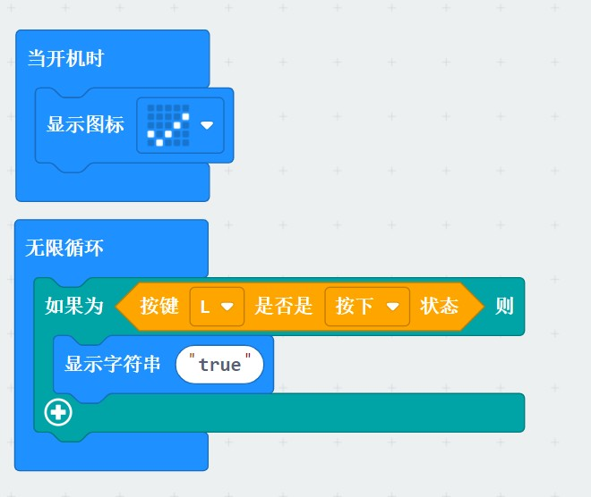
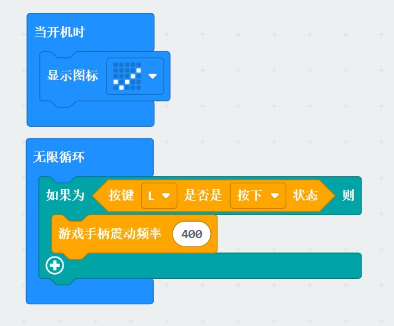

# joystick:bit
[English](README.md) 中文版

joystick:bit为   [深圳市易创空间科技有限公司](www.emakefun.com)出品的针对micro:bit开发的无线可编程手柄，支持micro:bit V1 V2

## 特点

- 左右双摇杆

- 手柄扩展microbit A，B按键

- 左右可编程独立按键

- 板子蜂鸣器和震动电机

- 2节7号电池供电

- 1个PH2.0-4Pin i2c接口 

  

## 图像化编程块说明

- 模块分类
  - 功能块，用于执行末项功能的模块

     

  - 数值块，用于输出数据，进行判断打印

     

  - 布尔块，用来进行判断，最终返回true或false

     
     

### 摇杆图形化块

- 获取摇杆x/y轴方向的值

    

### 独立按键编程图形块

- 当按键按下/释放时

   

### 震动电机编程图形块

- 配合按键使用

  

### python支持

## 开源许可
MIT
